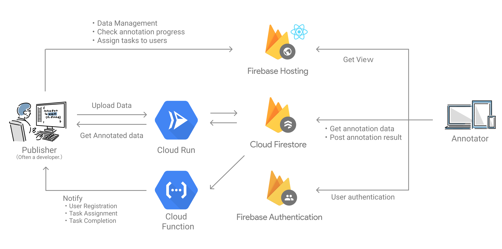

# Front

## Architecture



## Quick Start

See [here](../../../wiki/Quick-Start#4-frontend).


## Dev Commands

#### Initialization

```
make init
```

#### Start up the Local App server

```
make up
```

#### Deploy

```
make deploy
```

#### Install package

```
. bin/exec.sh yarn add {package}
```

#### Update package

```
. bin/exec.sh yarn upgrade {package}
```

#### Firebase Index Export

```shell
make export_index
```

